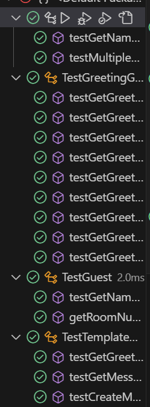
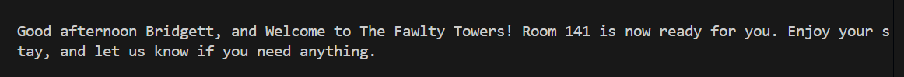
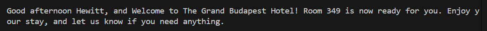
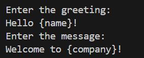
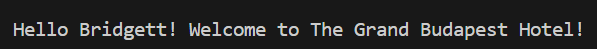
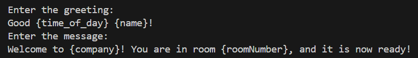

<Strong> Alexa Nelson </Strong>  
<Strong> Interview Project </Strong>  
<Strong> August 11th, 2024 </Strong>  

<Strong> How to Run: </Strong>  
<li> 1. Compile - "javac Main.java" </li>
<li> 2. Run - "java Main" </li>
<li> 3. Follow prompts on the screen for entering numbers or creating new template </li>  

<Strong> Overview: </Strong>  

I used object-oriented programming as the basis of the design for this program. My design decisions were all made in attempt to adhere to the SOLID principles of software design. I focused on the Single Responsibility principle and the Open/Closed principle. I used both of those principles to determine what classes were needed for the program and for the design of each of them. Each class has its own responsibility so it can easily be maintained and understood by other developers, and I used the Open/Closed principle to ensure there was room for possible expansion in the future. 

The design decision that was made for the template was to split the output message into two parts which includes the greeting and the message and insert the needed placeholders. This decision also makes it easy for the user to enter a new message rather than using the template. I designed it so the user could enter placeholders in their message that would be appropriately filled with guest / company selection or they could choose to not include some or all of the placeholders, leaving it very customizable for the user. 

The Main class is dedicated to running the project and is designed in a logical way for the program to gather the needed information. It has simple prompts to help guide the user in making the correct selection, and outputs the final message. 

By making these design decsions throughout the creation of the project, it would be easy to not only add more templates to Template.json that could be selected from but also more guests and companies can be added to the corresponding JSON files or even display other information to the guests. 

<Strong> Programming Language: </Strong>  

I used Java as the programming language for this project since Java is a object-oriented programming language as well as I have good knowledge in both program design and testing in Java.

<Strong> Verifying Correctness of the Program: </Strong>  

To verify the correctness of this program I used both unit testing and integration testing. 

For unit testing, the tests that I wrote can be seen in the "tests" folder included in the project. In the unit testing, I not only tested the classes methods and attributes, but I accounted for edge cases. The class that had many edge cases to account for is the GreetingGenerator. In the TestGreetingGenerator.java file, I tested the GreetingGenerator class with 9 tests in attempt to test the method getGreeting() for times between the edge cases as well as the edge cases where the greeting would change. In order, to test that method I had to make temporary changes to the method since it uses the LocalTime.now() for the program, but I wanted to be able to test different times. Below is a screenshot of all the tests passing including the TestGreetingGenerator tests (See PassingTests.png).

  

  

For integration testing, I compiled and ran the program using Main.java. I did multiple tests to ensure that it was parsing the JSON files and the program was running as expected. These tests included using the template and selecting different guests as well as different companies and ensuring the final message was correct. I also tested the functionality of the user being able to create their own message by selecting that option and entering different greetings and messages. I tested the greeting and message with including all of the placeholders and with only including some or none of the placeholders. Below are the screenshots of the integration testing (included in project folder).

Using Template:

Test 1:
    
Test 2:
    

Creating Template:

Test 1: (Using {name} and {company})
    
    
Test 2: (Using {name}, {company}, and {roomNumber})
    
    

<Strong> What Wasn't Completed, or What Would I Do with More Time? </Strong>  

I completed all the required functionality for the program, and if I had more time I would expand on the project in these following ways. The first expansion I would add is to have more templates for the user to select from and display previews of them on the screen during selection. This would allow for more use of the program without the user needing to select the add new message option. The second expansion I would add would be to allow the user to select if they wanted both the guests first and last name and if they wanted to include the location of the company. Lastly, a large expansion that I would add would be to make this program usable in more than just hotels to let guests know their room is ready, but rather in restaurants to let customers know their table is ready and in fast-food to let them know their food is ready. This program could even be expanded to text customers that their orders are ready for pickup at large coorporations or small buisnesses. 
